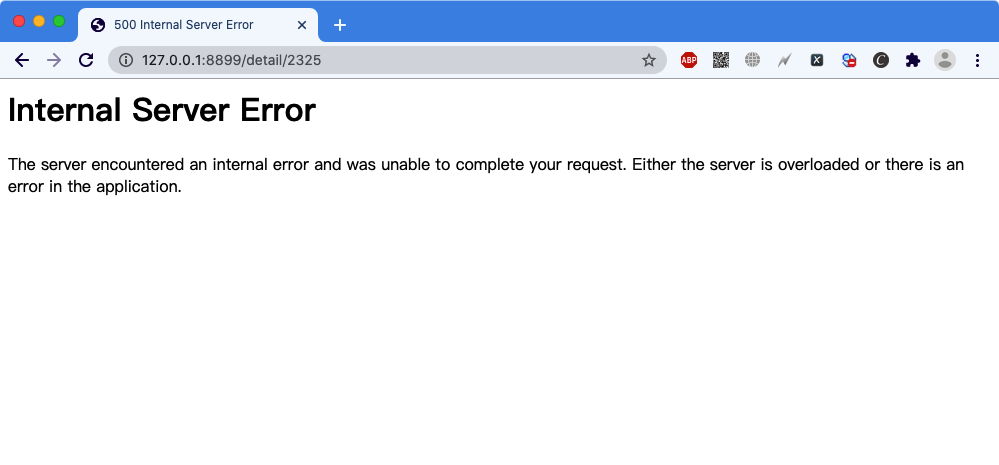

# 19级python2020年10月月考-编码题（2020年10月16日）

## 注意点
1. 每道题目用1次git commit，备注信息时："题目x"，勿写其它内容，例如第1题 备注就写"题目1"
2. 无需创建分支，老师阅卷时，只会审核master分支
3. 将config.ini中的数据库以及密码改为自己电脑数据库信息
4. 每题10分，共50分

## 题目1
请编写代码解决：用户未登录的情况下，访问新闻详情页失败的问题

效果图如下：

## 题目2
请编写代码实现：修改密码错误的问题

效果图如下：

## 题目3
请编写代码实现：新注册用户在未设置头像之前，显示默认头像的问题（默认头像为`/static/index/images/cat.jpg`）

## 题目4
请编写代码实现：后台审核新闻时，如果未通过，则将原因保存到数据库；且能够在用户中心-新闻列表中查看到此原因

效果图如下：

## 题目5
请编写代码实现下图中的要求

